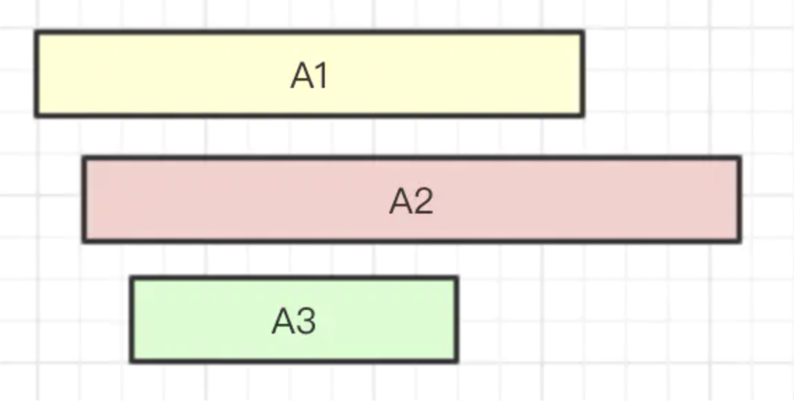

# 一些基于 RXJS 的有趣 Demo

interesting demos powered by `rxjs`.

the build tool is `parcel`.

`ts` runtime powered by `ts-node`.

## 01

将演示如何基于 pacel、react、ts 构建一个极简前端项目。

## 02

实现一个**进度条轮训查看状态**的需求。

会有个上传接口，上传文件后服务端会处理文件，并可以通过接口查看处理进度。

> 我们将分别用 **原生写法** 和 **rxjs写法** 来实现，来体现出两种风格写法的差异。

## 03

搜索框连续输入关键词请求数据

要求：

1、避免频繁请求，做防抖处理

2、处理好竞态场景

所谓竞态，指的是当我们依照 A1 -> A2 -> A3 顺序发起请求，我们也期望的是 A1 -> A2 -> A3 的顺序返回响应给应用。

但是，由于网络是异步的，有可能最后请求的 A3 反而最先收到相应，而后续的 A1 与 A2 的返回结果会覆盖 A3 的数据。导致明明搜索框显示的是 A3 请求的关键字，而列表页显示的是 A2 请求关键字的搜索结果。

所以，在设计输入框时，我们要处理好静态场景。

> 我们将分别用 **原生写法** 和 **rxjs写法** 来实现，来体现出两种风格写法的差异。

## 04

当鼠标进入盒子中时，每隔1秒，去调用一次API更新数据。

当鼠标离开盒子中时，停止调用API。

再次回到页面盒子时，重新执行以上操作。

> 我们将分别用 **原生写法** 和 **rxjs写法** 来实现，来体现出两种风格写法的差异。

## 05

来实现一个**简单的拖拽功能**。

要求鼠标在小方块上按下后能够拖着小方块进行移动；鼠标放开后，则运动停止。

> 我们将分别用 **原生写法** 和 **rxjs写法** 来实现，来体现出两种风格写法的差异。

## 06

06 是 05 的进阶，在 05 的基础上实现小方块拖拽接龙。

细节：给定 n 个小方块，要求拖拽第一个小方块进行移动，后续的小方块能够以间隔 0.1s 的时间跟着之前的小方块进行延迟模仿运动。

> 我们将分别用 **原生写法** 和 **rxjs写法** 来实现，来体现出两种风格写法的差异。
